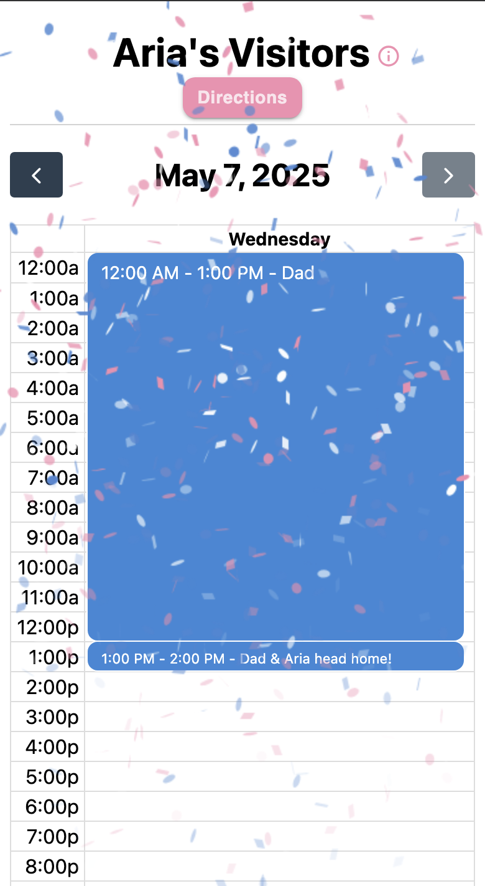
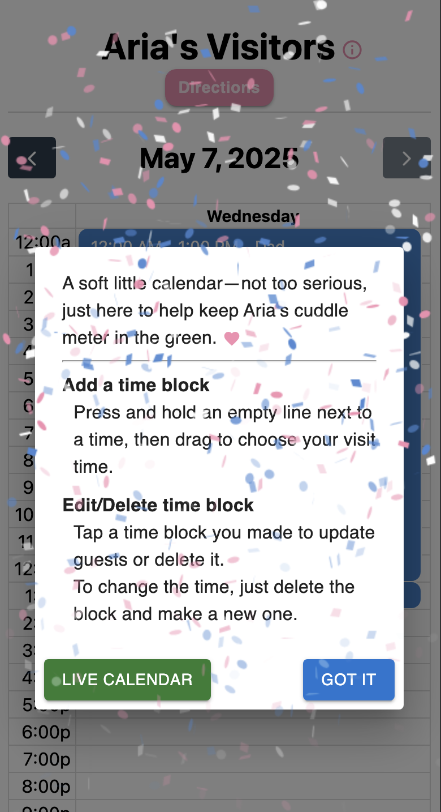
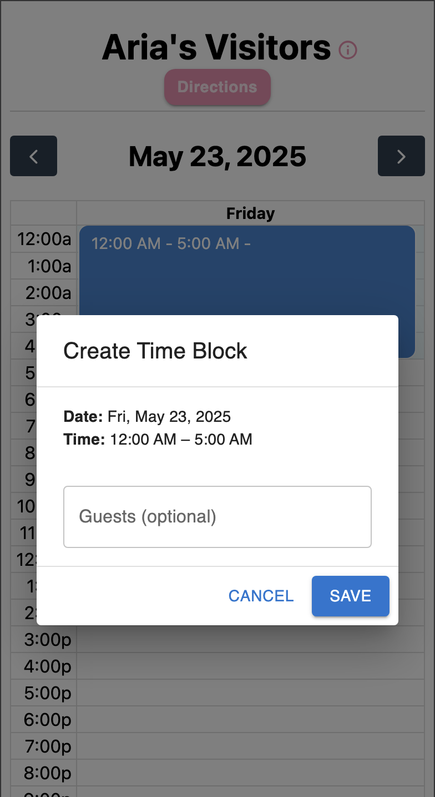
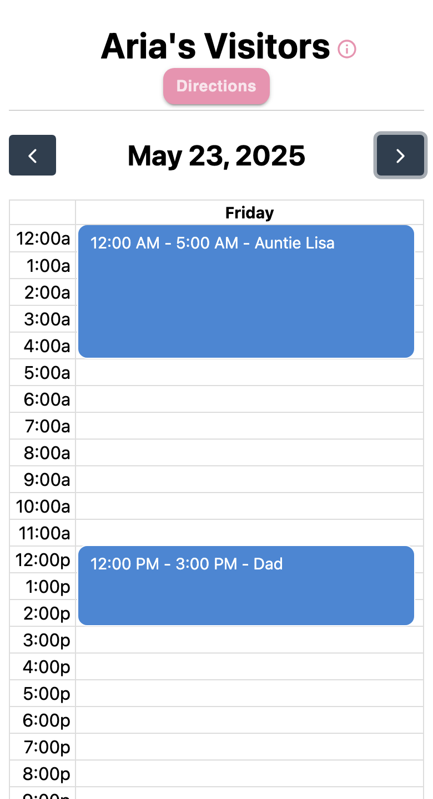
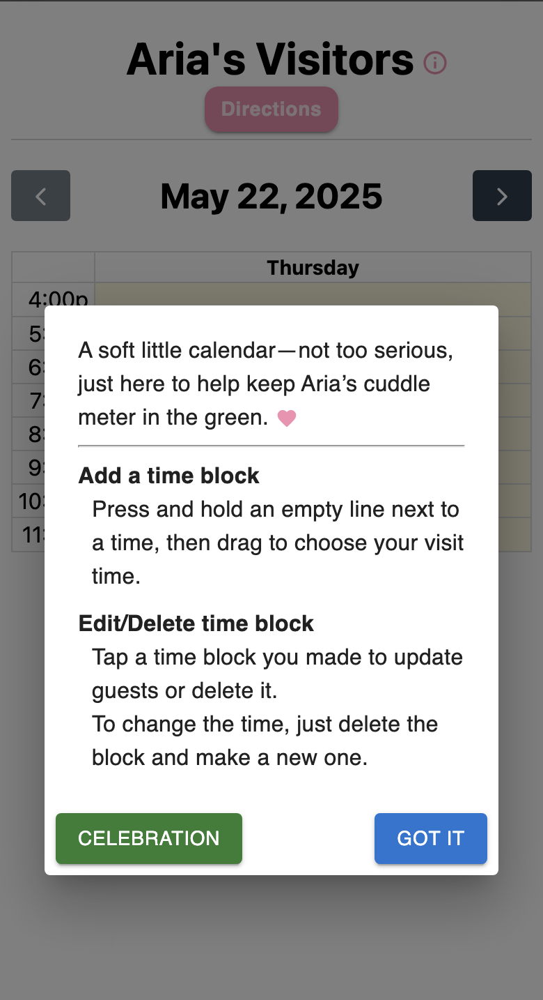

  

  

 

Aria Tracker is a visitor scheduling calendar — presented here as **Visitation Scheduler** for clarity.

Originally built to manage hospital visits for Aria, this app includes two modes:

- 🥳 **Celebration Mode (Static):** Created after Aria’s hospital discharge ❤️, this version shows a hardcoded visit history (pulled from the Neon database) with celebratory confetti effects.
- 📅 **Live Calendar Mode (Legacy):** A fully interactive version with database integration, guest management, and real-time updates via Pusher. It's still available for future use or demo purposes.

No login required — it's designed to be fast, friendly, and mobile-ready.

### ✨ Features

- 📅 **Time-block scheduling**
- ⚡ **Real-time updates** with Pusher (legacy mode)
- 🥳 **Confetti animations** (celebration mode)
- ✅ **Visitor-specific editing**
- 📱 **Mobile-friendly**
- 🔐 **Client-only identification** (via localStorage)

### 🧑‍💻 Built With

| Frontend                                                                                                          | Backend / Infra                                                                                                   |
| ----------------------------------------------------------------------------------------------------------------- | ----------------------------------------------------------------------------------------------------------------- |
|                |  |
|  |              |
|         |              |
|      |              |
|                       |                                                        |
|  |                                                                                                                   |

### 🕹️ Using the App

|                                                                                                                                                                                                                                                   |                                                                                                                 |
| ------------------------------------------------------------------------------------------------------------------------------------------------------------------------------------------------------------------------------------------------- | --------------------------------------------------------------------------------------------------------------- |
| When you first visit the page, you'll be in Celebration Mode. You can explore previous dates to see who visited Aria. Click the  icon next to "Aria's Visitors" to open the Info Dialog. |                                      |
|                                                                                                                                                                  | Click the "Live Calendar" button to switch to Live Calendar Mode and explore the full functionality of the app. |
| To create a time block, press and hold on a time slot, then drag to your desired start or end time. A pop-up will appear, allowing you to enter guest names. If left blank, the entry will default to "Aria's friend".                            |                                   |
|                                                                                                                                                                          | Here's an example of the calendar with a few time blocks filled in.                                             |
| While in Live Calendar Mode, you can return to Celebration Mode at any time by clicking the "Celebration" button in the Info Dialog.                                                                                                              |                                   |

### 🙏 Acknowledgments

This project was inspired by my daughter Aria, during her time in the hospital. Due to visitation limits, only a certain number of people could be with her at once — which made scheduling difficult.

We needed a simple way for both sides of our family to coordinate visits without constantly messaging us, and without us manually juggling everyone’s availability. This app made that possible — and helped us focus on Aria instead of logistics.

It’s a small project with a big heart: built to bring structure to chaos, and make sure no visit was missed.
